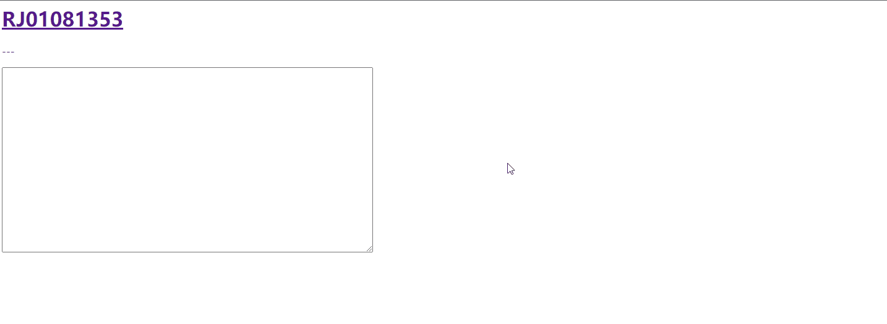
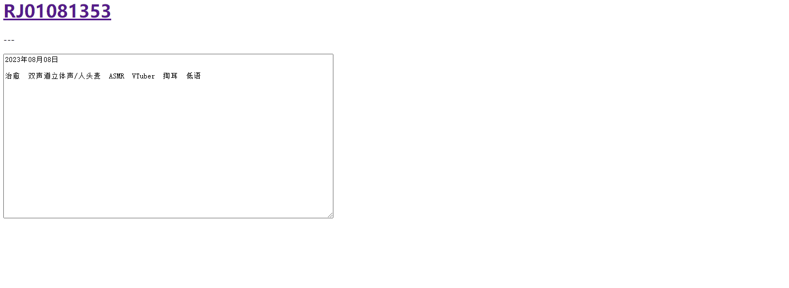
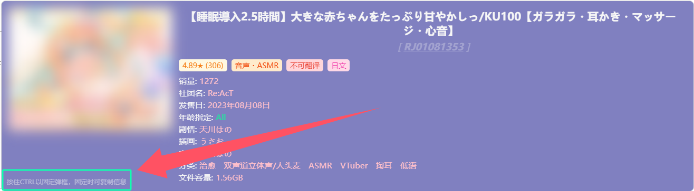
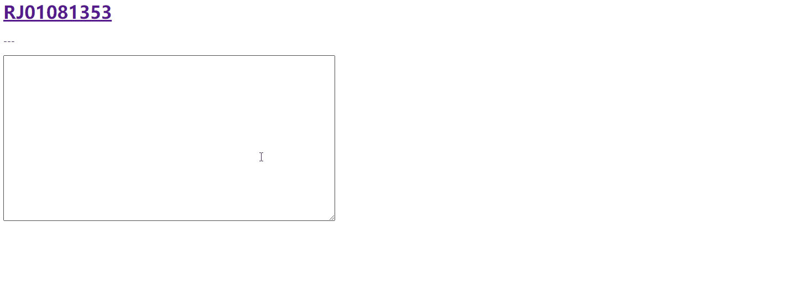
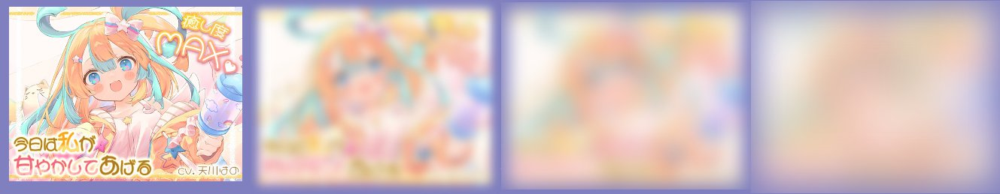
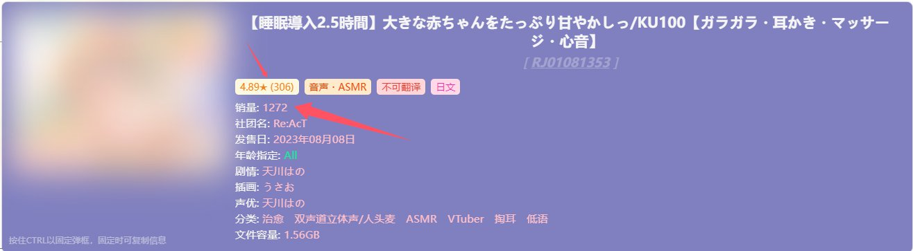

**_Document Translated from zh_CN by Microsoft Copilot:_**

# v4.8.6 New Features
- Pin Popup
- Information Copy
- Hint Bar
- SFW Mode
- New Information Addition
- CSP Policy Bypass for Covers

## Pin Popup

When the popup appears on the screen, hold down the `Ctrl` key (or `Command` key on MacOS) to pin the popup on the screen. Even if you move the mouse away from the RJ number, the popup will remain and its content can be selected.

Based on the pinned popup, you can copy the displayed information (see the “Information Copy” section). More actions may be available in the future.

**Note: When the popup is pinned, moving the mouse to another RJ number will have no effect. To check information of another RJ number, release the `Ctrl/Command` key**.

## Information Copy

When the popup is pinned, some information will support being copied.

With the popup pinned, move the mouse into the popup, and the information that can be copied will be underlined. Click the information with the left mouse button to copy its content.

If you click the title of the information, you can **copy all the information under that title** (e.g., clicking any voice actor's name will copy that specific voice actor's name, while clicking the left "Voice Actor" title will copy the entire list of voice actors to the clipboard).

## Hint Bar

A new hint bar is added to the bottom left of the popup to provide tips on some new features (such as pinning and copying features).

## SFW Mode

Enable in **Settings**, and once enabled, the cover image in the popup will be blurred.

The blur degree can be customized:
- Low - Only blurs details, image outlines remain visible
- Medium - Familiarity with the image topic may allow some to vaguely recognize the outlines, but most won't discern the content
- High - Almost completely obscures the content

When the popup is pinned, if you move the mouse over the blurred image, the blur effect will temporarily be removed. Once the mouse leaves the image, the blur effect will be restored. This feature can be toggled in settings, and the transition animation for the blur effect can also be turned on or off in settings.

## New Information Addition

In tag information, the **work rating** and **number of ratings** are displayed. The number of ratings serves as a reference for the credibility of the work rating and can be toggled in settings.

The display of **work sales** information is added, which is turned off by default. Please manually enable it in settings.

## CSP Policy Bypass for Covers
Using Tampermonkey's built-in API to load cover images allows them to display correctly on some webpages with CSP policy restrictions (e.g., MEGA cloud storage).

Please ensure that Tampermonkey is updated to a relatively new version (specific version not verified). If this feature cannot be used, the script will still load cover images in the original way.
