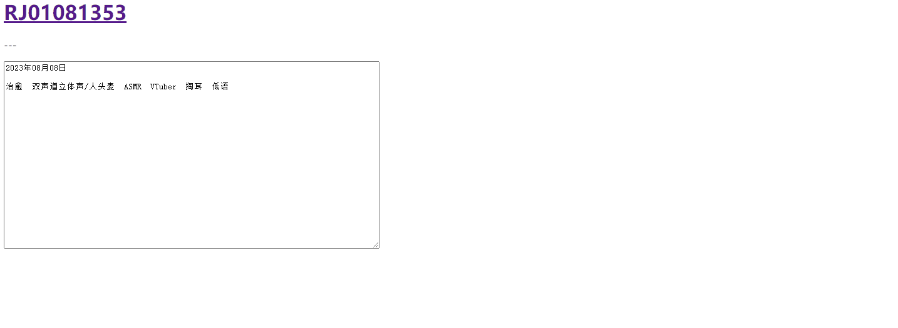
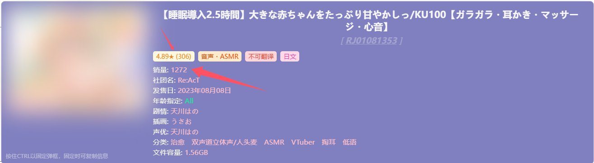

# v4.8.6 新功能
- 弹框固定
- 信息复制
- 提示栏
- SFW模式
- 新信息追加
- 封面CSP策略绕过

## 弹框固定

弹框出现在屏幕上时，按住`Ctrl`键（MacOS上为`Command`键）并保持不放，即可使弹框固定在屏幕上。此时，即使鼠标离开RJ号，弹框依然不会消失且内容可被选中。

在弹框被固定的基础上，可以对显示的信息进行复制（详见“信息复制”部分），后续可能会包含更多可用操作。

**注意：弹框被固定时，将鼠标移动到其它RJ号上将不会有任何作用。如果想转而查询其它RJ号的信息，请放开`Ctrl/Command`键**.

## 信息复制

弹框被固定的情况下，部分信息内容将支持被复制。

弹框被固定的同时，将鼠标移入弹框内，可复制的信息会被下划线标示，此时左键点击信息即可复制其内容。

如果点击信息对应的标题，则可**复制该标题下的所有信息**（如点击任意声优名称可以复制对应声优的名字，而点击左侧的“声优”标题，则会将整个声优列表复制到剪贴板）

## 提示栏

弹框左下角新增提示栏，用于对部分新功能进行提示（如固定功能和复制功能）。

## SFW模式

在**设置**中开启，开启后弹框中的封面图将会被模糊处理。

可自定义模糊程度：
- 低 - 仅模糊细节，图像轮廓依旧可见
- 中 - 熟悉图片主题的人可勉强看出轮廓，其他人大概率无法辨认内容
- 高 - 几乎完全看不出内容

在固定弹框的情况下，如果将鼠标移动到模糊的图像上，则图像的模糊效果会被暂时移除，鼠标离开图像后恢复模糊效果。该功能可在设置中开关，模糊效果的过渡动画也可在设置中选择关闭或开启。

## 新信息追加

标签信息中，追加**作品评分**及**评分人数**显示。评分人数作为作品评分可信度的参考，可在设置选项中进行开关。

追加**作品销量**信息显示，默认关闭，请手动到设置中开启。

## 封面CSP策略绕过
使用Tampermonkey内置API实现封面图的加载，使得封面可在一些设置了CSP策略限制的网页中正常展示（如MEGA网盘等）

使用此功能请保证Tampermonkey为较新版本（具体版本号未验证），如果无法使用该功能，则脚本依旧会按原方式加载封面图。
