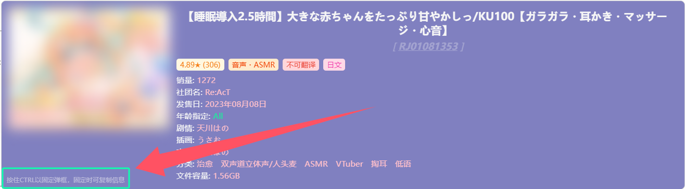
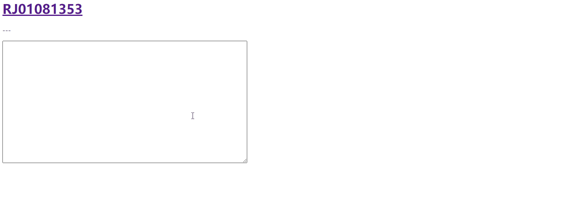

**_翻譯by Microsoft Copilot，考慮語言習慣_**

# v4.8.6 新功能
- 彈框固定
- 資訊複製
- 提示欄
- SFW模式
- 新資訊新增
- 封面CSP策略繞過

## 彈框固定

當彈框出現在螢幕上時，按住 `Ctrl` 鍵（MacOS 上為 `Command` 鍵）並保持不放，即可將彈框固定在螢幕上。此時，即使滑鼠離開 RJ 號，彈框依然不會消失且內容可被選取。

在彈框被固定的基礎上，可以對顯示的資訊進行複製（詳見「資訊複製」部分），後續可能會包含更多可用操作。

**注意：彈框被固定時，將滑鼠移動到其他 RJ 號上將不會有任何作用。如果想查詢其他 RJ 號的資訊，請放開 `Ctrl/Command` 鍵**.

## 資訊複製

彈框被固定的情況下，部分資訊內容將支援被複製。

彈框被固定的同時，將滑鼠移入彈框內，可複製的資訊會被底線標示，此時左鍵點擊資訊即可複製其內容。

如果點擊資訊對應的標題，則可**複製該標題下的所有資訊**（如點擊任意聲優名稱可以複製對應聲優的名字，而點擊左側的「聲優」標題，則會將整個聲優列表複製到剪貼簿）。

## 提示欄

彈框左下角新增提示欄，用於對部分新功能進行提示（如固定功能和複製功能）。

## SFW模式

在 **設置** 中開啟，開啟後彈框中的封面圖將會被模糊處理。

可自訂模糊程度：
- 低 - 僅模糊細節，圖像輪廓依舊可見
- 中 - 熟悉圖片主題的人可勉強看出輪廓，其他人大概無法辨認內容
- 高 - 幾乎完全看不出內容

在固定彈框的情況下，如果將滑鼠移動到模糊的圖像上，則圖像的模糊效果會被暫時移除，滑鼠離開圖像後恢復模糊效果。該功能可在設置中開關，模糊效果的過渡動畫也可在設置中選擇關閉或開啟。

## 新資訊新增

標籤資訊中，新增**作品評分**及**評分人數**顯示。評分人數作為作品評分可信度的參考，可在設置選項中進行開關。

新增**作品銷量**資訊顯示，默認關閉，請手動到設置中開啟。

## 封面CSP策略繞過
使用 Tampermonkey 內建 API 實現封面圖的加載，使得封面可在一些設置了 CSP 策略限制的網頁中正常展示（如 MEGA 網盤等）。

使用此功能請確保 Tampermonkey 為較新版本（具體版本號未驗證），如果無法使用該功能，則腳本依舊會按原方式加載封面圖。
